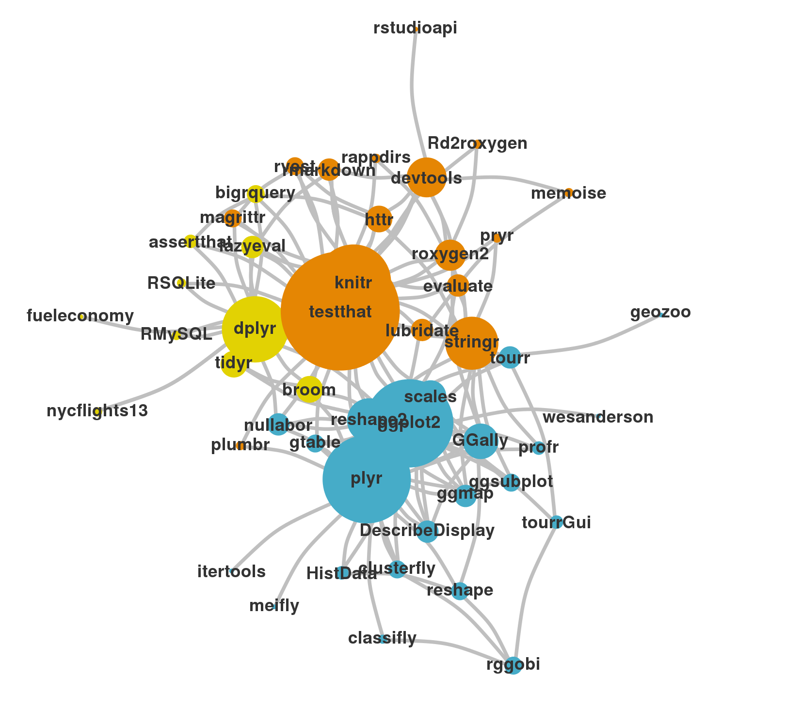

# Algumas novidades essenciais

## RStudio

  

## R Markdown e knitr

  
  

## Hadleyverse

  
  

Veja os pacotes desta página https://github.com/hadley

## Git e GitHub

  

### `git clone`
### `git commit`
### `git pull`
### `git push`

## Stackoverflow

  

### Sistema de rank para perguntas e usuários

### Perguntas e respostas em alta qualidade

### Além da programação! Ver CrossValidated

## Pesquise!

### **Shiny** - Aplicações interativas na web usando o R

### **R Consortium** - Investimento pesado das maiores companhias no desenvolvimento do R

### **Kaggle** - Desafios de data science

### **Coursera** - Cursos online grátis sobre R e muito mais

### **R Jobs** - Plataforma de divulgação de empregos que envolvem o R

### Leia [http://kbroman.org/hipsteR/](http://kbroman.org/hipsteR/)

### ...

# Nosso curso

## 3 aulas

### Manipulação de dados com `dplyr` e `tidyr`

### Visualização de dados com `ggplot2` e relatórios com `rmarkdown` e `knitr`

### Desenvolvimento de pacotes com `devtools` e `roxygen2`

## Outros pacotes 

### `plyr` para generalização das funções `lapply`, `sapply`, `apply` etc

### `stringr` para manipulação de textos

### `lubridate` para manipulação de datas

### `httr`, `xml2` e `rvest` para raspagem de dados da web (web scraping)

### `caret` para construção de modelos preditivos

## Nossa base de dados

### Futebol

- Dados retirados do site [chance de gol](http://www.chancedegol.com.br).

Acesse a [página do curso no github](https://github.com/curso-r/mcUFSCar2015)

## Pacotes utilizados

Acesse a [página do curso no github](https://github.com/curso-r/mcUFSCar2015)

# &nbsp;
