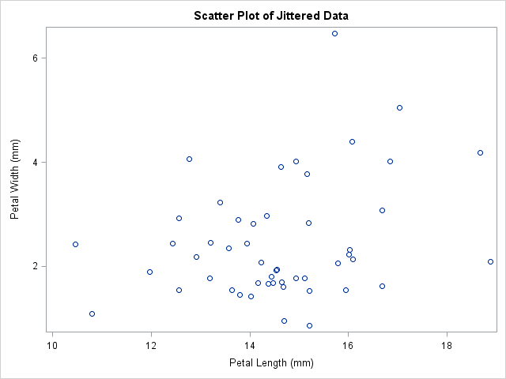
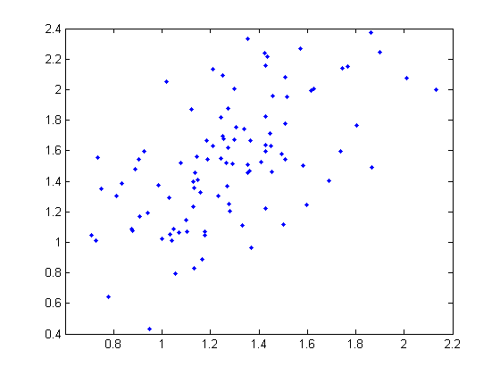
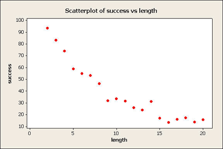

```{r, echo=FALSE, warning=FALSE, message=FALSE}
library(ggplot2)
library(dplyr)
library(mcUFSCar2015)
library(tidyr)
```

ggplot2
===============================================================================

## Introdução {.build}

O que é um gráfico estatístico? 

Leland Wilkinson respondeu essa pergunta!

*The Grammar of Graphics*

- Conjunto de dados

- Aspectos estéticos de formas geométricas

## Motivação 1

- É fácil de usar.

- Foi criado pelo Hadley.

- Gráficos bonitos e elegantes.

## Motivação 2 | SAS



## Motivação 2 | SPSS


## Motivação 2 | Matlab



## Motivação 2 | Minitab



## Motivação 2 | R-base

```{r, echo=FALSE}

x <- sample(1:50, 80, replace=T)
y <- x + rnorm(80, 0, 5)

plot(x, y)

```

## Motivação 2 | R-ggplot2

```{r, echo=FALSE}
qplot(x, y, geom="point")
```

## Motivação 3

```{r, echo=FALSE}
df <- data.frame(usa = rep(c("Sim", "Não"), c(5, 5)),
                 expec = c(70, 80, 85, 96, 121, 78, 74, 71, 66, 59),
                 ano = rep(2010:2014, 2))

ggplot(df, aes(x = ano, y = expec, fill = usa)) +  
  geom_bar(stat="identity", width = 0.4, position = "dodge") +
  xlab("Ano") +
  ylab("Expectativa de vida") +
  labs(fill = "Utiliza o ggplot?")
```

## Motivação 3

```{r, echo=FALSE}

df <- data.frame(usa = rep(c("Sim", "Não"), c(100,100)),                 
                 salario = c(rnorm(100, 20000, 1000), abs(rnorm(100, 2000, 1200))))

df$salario[1] = 2500

ggplot(df, aes(x = usa, y = salario, fill = usa)) +
  geom_boxplot(width = 0.5) +
  guides(fill=FALSE) +
  xlab("Utiliza o ggplot") +
  ylab("Salário (reais)") +
  scale_y_continuous(labels = scales::dollar)
```

## Motivação 3

```{r, echo=FALSE}
df <- data.frame(ano = 2010:2020,
                 prop = c(0.01, 0.09, 0.14, 0.18, 0.23, 0.34, 0.39, 0.44, 0.60, 0.88, 1.1))

ggplot(df, aes(x = as.character(ano), y = prop, group = 1)) +
  geom_line() +
  geom_point(size = 5, shape = 22, fill = "green") +  
  guides(fill = FALSE) +
  xlab("Ano") +
  ylab("Proporção de usuários no mundo") +
  scale_y_continuous(labels = scales::percent, breaks = 0:10 / 10)
```

## Onde procurar ajuda

### [http://www.rstudio.com/resources/cheatsheets/](http://www.rstudio.com/resources/cheatsheets/)

### [http://docs.ggplot2.org/](http://docs.ggplot2.org/)

### [http://github.com/hadley/ggplot2-book](http://github.com/hadley/ggplot2-book)

## Tudo o que você precisa saber

- Dados --- `data =` e aspectos estéticos (*mapping*) --- `aes()` 

- Layers: 
    - formas geométricas --- `geom_*()`
    - transformações estatísticas --- `stat_*()`

- Coordenadas --- `coord_*()`

- Facets --- `facet_*()`

- Theme --- `theme()`

## Exemplos

```{r}
d <- cdg %>% 
  separate(placar, c('gols_mandante', 'gols_visitante'), 
           sep = 'x', remove = TRUE, convert = TRUE) %>% 
  mutate(pts_mandante = ifelse(gols_mandante > gols_visitante, 3, 
                               ifelse(gols_mandante == gols_visitante, 1, 0)),
         pts_visitante = 3 - pts_mandante,
         pts_visitante = ifelse(pts_visitante == 2, 1, pts_visitante)) %>% 
  unite(mandante_u, mandante, pts_mandante, sep = '_') %>% 
  unite(visitante_u, visitante, pts_visitante, sep = '_') %>%
  select(ano, ends_with('_u')) %>% 
  gather(key, value, -ano) %>% 
  separate(value, c('time', 'pontos'), sep = '_', convert = TRUE) %>% 
  group_by(ano, time) %>% 
  summarise(pontos = sum(pontos)) %>% 
  ungroup() %>% 
  arrange(ano, desc(pontos))
```

## Dados

```{r}
d
```


## Dados

```{r}
tbl_df(mtcars)
```

## Exemplos

```{r}
ggplot(data = mtcars, aes(x = disp, y = mpg)) +
  geom_point()
```

## Exemplos

```{r}
# mais ou menos compatível com magrittr
suppressMessages(library(magrittr))
mtcars %>%
  ggplot(aes(x = disp, y = mpg)) + # deveria ser %>% e nao +, né? :(
  geom_point()
```

## Exemplos

```{r}

ggplot(data = mtcars) +
  geom_point(aes(x = disp, y = mpg))

```

## Exemplos

```{r fig.height=4}

cdg %>% 
  separate(placar, c('gols_mandante', 'gols_visitante'), 
           sep = 'x', remove = TRUE, convert = TRUE) %>% 
  select(ano, starts_with('gols')) %>% 
  gather(lugar, gols, -ano) %>% 
  group_by(ano, lugar) %>% 
  summarise(gols = sum(gols)) %>% 
  ggplot(aes(x = gols, fill = lugar)) +
  geom_dotplot(binwidth = 20)

```


## Exemplos

```{r}

ggplot(data = mtcars) +
  geom_point(aes(x = disp, y = mpg, colour = as.character(am)))

```

## Exemplos

```{r}

ggplot(data = mtcars) +
  geom_point(aes(x = disp, y = mpg, colour = as.character(am), size = cyl))

```

## Exemplos {.build}

```{r}

ggplot(data = mtcars) +
  geom_point(aes(x = disp, y = mpg), colour = "blue", size = 5, 
             shape = 2)
```

## Exercício

Faça o gráfico que sempre aparece no RStudio quando você pesquisa no google

```{r}
diamonds
```

## Exemplos {.build}

```{r}

ggplot(data = mtcars) +
  geom_point(aes(x = cyl, y = mpg), stat = "summary", fun.y= mean)

```

## Exemplos {.build}

```{r}

ggplot(data = mtcars) +
  geom_line(aes(x = cyl, y = mpg), stat = "summary", fun.y= mean)

```

## Exemplos

```{r, fig.height=3, fig.width=5}

ggplot(data = mtcars) +
  geom_line(aes(x = cyl, y = mpg), stat = "summary", fun.y= mean) +
  geom_point(aes(x = cyl, y = mpg), stat = "summary", fun.y= mean)

```

## Exemplos

```{r, fig.height=3, fig.width=5}

ggplot(data = mtcars) +
  geom_boxplot(aes(x = as.character(gear), y = mpg, 
                   fill = as.character(gear)))

```

## Exemplos

```{r, fig.height=3, fig.width=5}

ggplot(data = mtcars) +
  geom_boxplot(aes(x = as.character(gear), y = mpg, 
                   fill = as.character(gear))) +
  xlab("") +
  ylab("Milhas por galão") +
  labs(fill="Número de marchas")

```

## Exercício {.build}

```{r}
df <- data.frame(ano = 2010:2020,
                 prop = c(0.01, 0.09, 0.14, 0.18, 0.23, 
                          0.34, 0.39, 0.44, 0.60, 0.88, 1.1))

```

```{r, echo=FALSE, fig.height=3, fig.width=5}

df <- data.frame(ano = 2010:2020,
                 prop = c(0.01, 0.09, 0.14, 0.18, 0.23, 0.34, 0.39, 0.44, 0.60, 0.88, 1.1))

ggplot(df, aes(x = as.character(ano), y = prop, group = 1)) +
  geom_line() +
  geom_point(size=5, shape = 22, fill = "green") +  
  guides(fill=FALSE) +
  xlab("Ano") +
  ylab("Proporção de usuários no mundo")
  
```

## Exercício

```{r echo=FALSE}
d %>% 
  filter(ano >= 2006) %>% 
  group_by(ano) %>% 
  mutate(posicao = row_number(), 
         grupo = ifelse(posicao <= 4, 'G4', 
                        ifelse(posicao >= 17, 'Rebaixados', 'Nada'))) %>% 
  ggplot(aes(x = ano, y = pontos, colour = grupo, group = time)) +
  geom_point() +
  geom_line() +
  theme_bw() +
  xlab('Ano') +
  ylab('Pontos') +
  labs(colour = 'Grupo')
```


## Usando datas

```{r}
library(lubridate)
library(scales)
cdg %>% 
  filter(ano >= 2007) %>% 
  mutate(data_jogo = as.Date(dmy(data_jogo))) %>% 
  separate(placar, c('gols_mandante', 'gols_visitante'), 
           sep = 'x', remove = TRUE, convert = TRUE) %>% 
  mutate(gols = gols_mandante + gols_visitante) %>% 
  group_by(data_jogo, ano) %>% 
  summarise(gols = sum(gols)) %>% 
  ungroup %>% 
  # filter(ano == 2014) %>% 
  ggplot(aes(x = data_jogo, y = gols, colour = factor(ano))) +
  geom_point() +
  geom_line()
```

## Mapas

```{r}
data('br_uf_map', package = 'abjutils')
ggplot(br_uf_map) +
  geom_map(aes(x = long, y = lat, map_id = id), map = br_uf_map,
           fill = 'transparent', colour = 'black') +
  coord_equal()
```


Extras
===============================================================================

## ggvis

- Próxima iteração do ggplot2.
- Compatível com `%>%`.
- Gráficos dinâmicos baseados em `HTML5` e `javascript`.
- Ainda em desenvolvimento.

## Diferenças para o ggplot2

## Exemplo: tooltip

```{r}
library(ggvis)
all_values <- function(x) {
  if(is.null(x)) return(NULL)
  paste0(names(x), ": ", format(x), collapse = "<br />")
}
base <- mtcars %>% ggvis(x = ~wt, y = ~mpg) %>%
  layer_points()
```

## Exemplo: tooltip

```{r}
base %>% add_tooltip(all_values, "hover")
```


